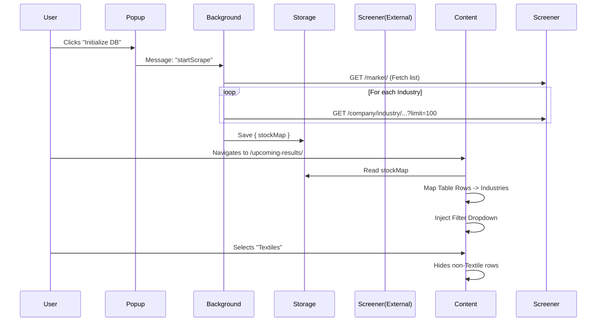

# Architecture

## Modules

### 1. Background Service (`background.js`)
- **Role**: Data Aggregator.
- **Responsibility**: 
  - Handles the "Warm-up" process (scraping `/market/` and sub-pages).
  - Manages rate-limited fetching queue.
  - Stores the resulting `Map<Symbol, Industry>` in `chrome.storage.local`.

### 2. Content Script (`content.js`)
- **Role**: UI Injector & Interactor.
- **Responsibility**:
  - Runs on `screener.in/upcoming-results/*` and `screener.in/results/latest/*`.
  - Injects **Custom Combobox** (Searchable Dropdown) into Sidebar.
  - **Multi-table Support**: Iterates over all `table.data-table` instances (e.g., on `/results/latest/`).
  - **Deep Scanning**: Automatically fetches subsequent pages if single table. **Disabled** on multi-table pages to prevent data corruption.
  - Hides native pagination when filtering active.

### 3. Popup (`popup.html` / `popup.js`)
- **Role**: Control Panel.
- **Responsibility**:
  - Allows user to manually trigger/refresh the industry database.
  - **State Persistence**: Polls `getScrapeStatus` on load to restore active progress bars.
  - Displays database status (count, last updated) and progress.

## Data Flow

