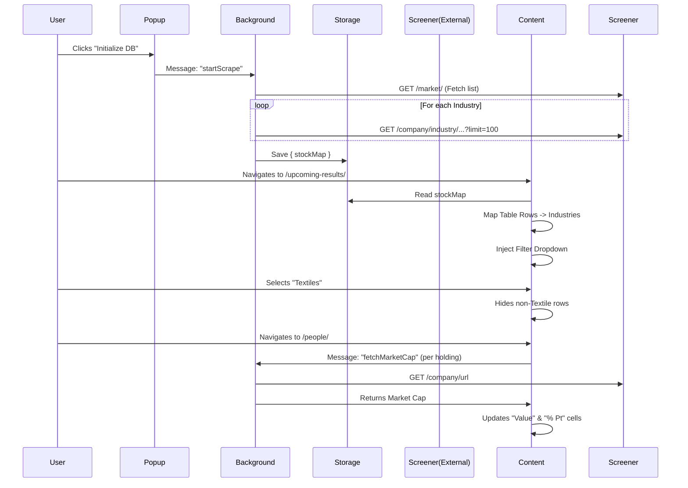

# Architecture

## Modules

### 1. Background Service (`background.js`)
- **Role**: Data Aggregator.
- **Responsibility**: 
  - Handles the "Warm-up" process (scraping `/market/` and sub-pages).
  - Manages rate-limited fetching queue.
  - Stores the resulting `Map<Symbol, Industry>` in `chrome.storage.local`.
  - **Global Backoff Manager**: Maintains a persistent rate-limiting backoff level and duration across all background and content script requests.

### 2. Content Script (`content.js`)
- **Role**: UI Injector & Interactor.
- **Responsibility**:
  - Runs on `screener.in/upcoming-results/*` and `screener.in/results/latest/*`.
  - Injects **Custom Combobox** (Searchable Dropdown) into Sidebar.
  - **Specialized Strategies**:
    - `TableStrategy`: Handles standard `table.data-table` layouts (e.g. Upcoming Results). Injects status widget *inside* container cards to preserve layout.
    - `ListStrategy`: Handles `.mark-visited .flex-row` layouts (e.g. Latest Results). Manages paired Header+Data DOM nodes.
  - **Deep Scanning**: Robustly fetches subsequent pages for both Table and List views, ensuring financial data tables are correctly adopted and appended.
  - **Cleanup**: Implements `cleanupItems` to remove deep-fetched rows when filters change.
  - **Portfolio Analysis** (`PeopleStrategy`):
    - Target: `screener.in/people/*`
    - Logic: Detects Shareholdings table -> Injects Columns -> Fetches Market Cap (via Background) -> Calculates Value from latest holding.
- **Adaptive UI**: Detects systems and Screener.in theme changes to shift between Light/Dark modes.
- **Mobile Resilience**: Uses `MutationObserver` to watch for header/sidebar transformations (common when Screener.in switches to modal-based filters on mobile) and re-executes injection logic.

### 3. Popup (`popup.html` / `popup.js`)
- **Role**: Control Panel.
- **Responsibility**:
  - Allows user to manually trigger/refresh the industry database.
  - **State Persistence**: Polls `getScrapeStatus` on load to restore active progress bars.
  - Displays database status (count, last updated) and progress.

## Data Flow

