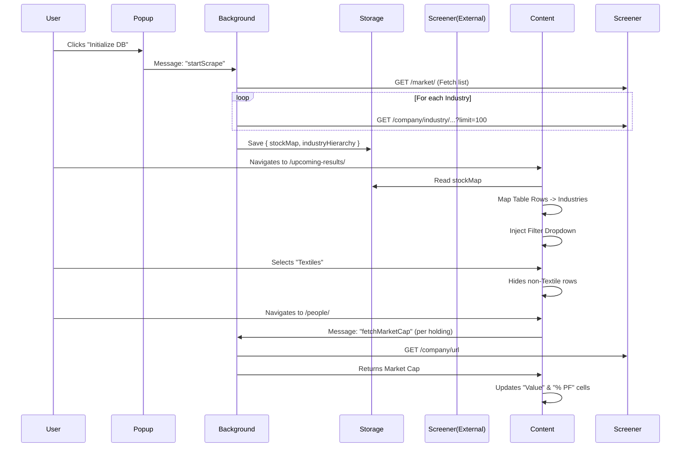

# Architecture

## Modules

### 1. Background Service (`src/background/background.js`)
- **Role**: Data Aggregator.
- **Responsibility**: 
  - Handles the "Warm-up" process (scraping `/market/` and sub-pages).
  - **Hierarchy Extraction**: Parses breadcrumb navigation (`<ul>` containing "Industries" link) on each industry page to extract NSE's 4-level classification (Macro → Sector → Industry → Basic Industry).
  - Manages rate-limited fetching queue.
  - Stores the resulting `stockMap` (Symbol → Basic Industry) and `industryHierarchy` (Basic Industry → {macro, sector, industry, basicIndustry}) in `chrome.storage.local`.
  - **Global Backoff Manager**: Maintains a persistent rate-limiting backoff level and duration across all background and content script requests.

### 2. Content Script (`src/content/content.js`)
- **Role**: UI Injector & Interactor.
- **Responsibility**:
  - Runs on `screener.in/upcoming-results/*` and `screener.in/results/latest/*`.
  - Injects **Custom Combobox** (Searchable Dropdown) into Sidebar with **Multi-Level Hierarchy Search**:
    - Loads both `stockMap` and `industryHierarchy` from storage.
    - Searches across all 4 hierarchy levels (macro, sector, industry, basicIndustry) for maximum discoverability.
    - Displays each industry with its full hierarchy path (Macro → Sector → Industry) below the name for context.
  - **Specialized Strategies**:
    - `TableStrategy`: Handles standard `table.data-table` layouts (e.g. Upcoming Results). Injects status widget *inside* container cards to preserve layout. Adds and manages an "Industry" column dynamically.
    - `ListStrategy`: Handles `.mark-visited .flex-row` layouts (e.g. Latest Results). Manages paired Header+Data DOM nodes.
  - **Deep Scanning**: Robustly fetches subsequent pages for both Table and List views, ensuring financial data tables are correctly adopted and appended.
  - **Cleanup**: Implements `cleanupItems` to remove deep-fetched rows when filters change.
  - **Portfolio Analysis** (`PeopleStrategy`):
    - Target: `screener.in/people/*`
    - Logic: Detects Shareholdings table -> Injects Columns -> Fetches Market Cap (via Background) -> Calculates Value from latest holding.
- **Mobile Resilience**: Uses `MutationObserver` to watch for header/sidebar transformations (common when Screener.in switches to modal-based filters on mobile) and re-executes injection logic.
- **Styling (`src/content/styles.css`)**: Adaptive CSS for light/dark modes and custom UI components.

### 3. Popup (`src/popup/popup.html` / `src/popup/popup.js`)
- **Role**: Control Panel.
- **Responsibility**:
  - Allows user to manually trigger/refresh the industry database.
  - **State Persistence**: Polls `getScrapeStatus` on load to restore active progress bars.
  - Displays database status (count, last updated) and progress.

## Data Flow

