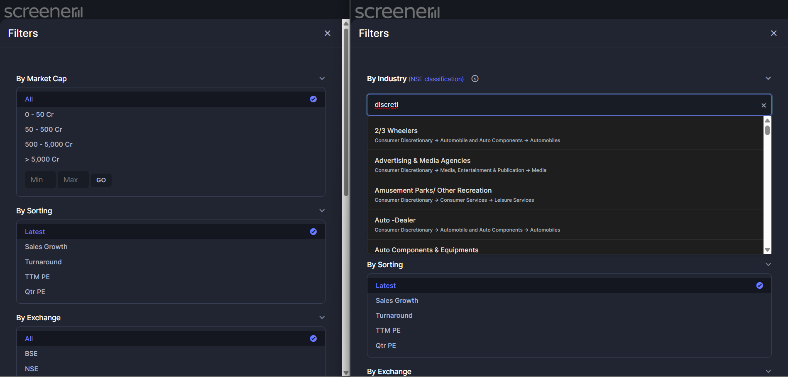
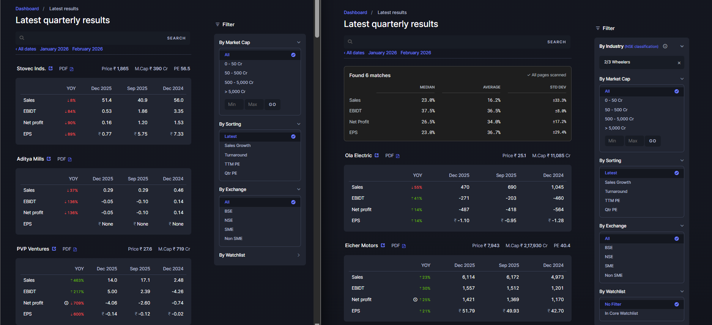
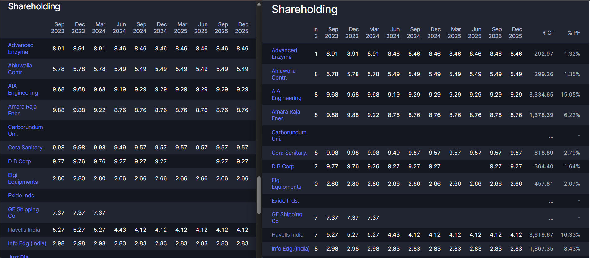
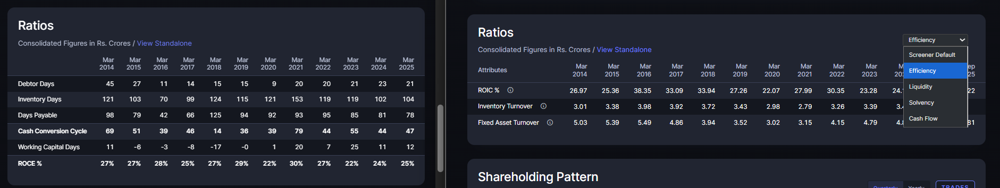
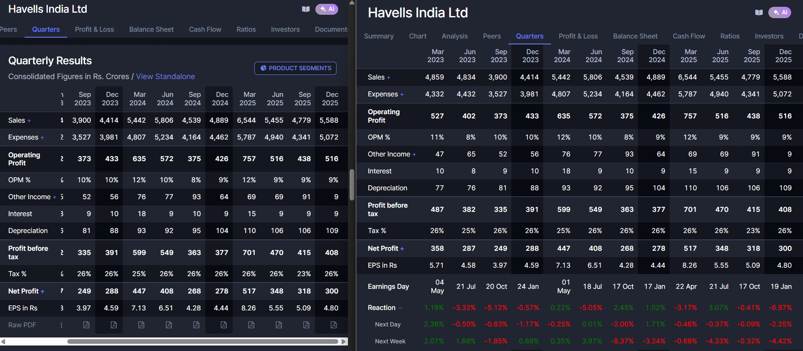

# Screener.in Industry Filter Extension

A powerful Chrome Extension that adds high-impact features to India's most beloved [Screener.in](https://www.screener.in/).

## 🚀 Features

### 1. Industry Filter Widget with Multi-Level Search

- **Native Integration**: Adds a "By Basic Industry" dropdown seamlessly into the Screener sidebar.
- **Multi-Level Hierarchy Search**: Search industries by any NSE classification level:
  - Type **"Consumer"** → See all Consumer Discretionary industries
  - Type **"Auto"** → See all Automobile-related industries
  - Type **"Chemicals"** → See all Chemical industries
  - Or search directly by basic industry name (e.g., "2/3 Wheelers")
- **Hierarchy Context**: Each industry displays its full classification path (Macro → Sector → Industry) below the name, helping you understand the NSE's 4-level structure at a glance.
- **Broad Compatibility**: Works on multiple Screener.in pages:
  - **[Upcoming Results](https://www.screener.in/upcoming-results/)**
  - **[Latest Results](https://www.screener.in/results/latest/)**
  - **[Concalls](https://www.screener.in/concalls/)**
  - **[Upcoming Concalls](https://www.screener.in/concalls/upcoming/)**
    - **Note**: this doesn't work. It's a placeholder for when screener.in adds filtering support for upcoming concalls.

**Learn More**: Visit [NSE Industry Classification](https://www.nseindia.com/static/products-services/industry-classification) to understand the four levels: Macro Economic Sector → Sector → Industry → Basic Industry. The filter applies at the Basic Industry level but is searchable across all levels.

### 2. Aggregate Statistics

- **Latest Results Analytics**: Among the filtered entities, view Median, Average, and Standard Deviation for YoY growth in Sales, EBITDA, Net Profit, and EPS.

### 3. Superinvestor portfolio size view

> Buying into the hype of a superinvestor throwing 50bps into a hot stock? Not anymore.
  - `screener.in/people/*/#shareholdings` pages now have **"₹ Cr"** (Value) and **"% PF"** (Percentage of Portfolio) columns. 

### 4. Company Ratios Dashboard

- **Instant Insights**: Re-imagines the Ratios section on individual company pages.
- **Multiple Templates**: Quickly switch between different analytical views (Efficiency, Liquidity, Solvency, Cash Flow, etc.).

### 5. Quarterly Analysis & Price Reactions

- **Earnings History**: View exact results announcement dates directly in the "Quarters" table.
- **Market Impact**: Instantly see price reactions (Day, Next Day, and Week) for each quarter.
- **Holiday-Aware**: Robust logic handles announcements on market holidays and weekends by automatic shifting to the next trading day.
- **Batch Optimized**: High-performance data fetching uses batching to ensure stability and accuracy across many years of history.

### 6. Seamless UI/UX
- **Dark Mode Support**: Adaptive UI that matches Screener.in's native Light and Dark themes instantly using CSS variables.
- **Native Experience**: Clean integration, in line with screener's beloved UI/UX.

### Upcoming: 
1. Buyback helpers - CMP, Return %, IRR % for the buyback table
2. View corresponding quarter results date for the last 3 years in the Upcoming results table - identify companies reporting early/late relative to history at a glance - perhaps indicative of a beat/miss

## 🛠️ Installation

1.  **Clone/Download** this repository.
2.  Open Chrome and navigate to `chrome://extensions/`.
3.  Enable **Developer mode** (toggle in top right).
4.  Click **Load unpacked**.
5.  Select the directory containing this `manifest.json`.

**Note: Works on mobile views too**:
Use mobile browsers like [Quetta](https://www.quetta.net/) (not an endorsement) that support custom extensions.

## 🏗️ Architecture

- **Manifest V3**: Secure and performant.
- **Rate Limiting**: Smart backoff system to respect Screener.in server limits.

## 🔄 Data Synchronization

The extension automatically keeps the industry classification database up-to-date:

1.  **Smart Fetching**: On startup and once daily, the extension checks for updates from the [external industry map](https://github.com/eggmasonvalue/stock-industry-map-in).
2.  **Efficient Sync**: It uses `ETag` headers to ensure data is only downloaded when it has actually changed on GitHub. If the data is unchanged (HTTP 304), no bandwidth is used.
3.  **Zero-Config**: Users don't need to manually refresh the database, though a "Refresh" button is available in the popup if needed.

---
*Note: This is an unofficial extension and is not affiliated with Screener.in.*

## 📜 License

This project is licensed under the **GNU General Public License v3.0**. See the [LICENSE](LICENSE) file for more details.
